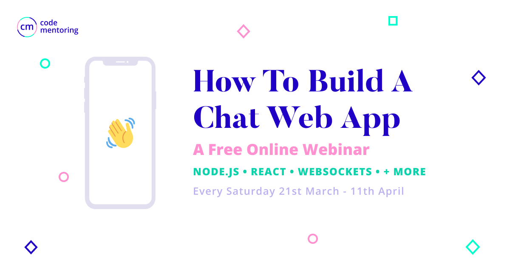

# Code Mentoring Webinar - How to Build a Chat Web App

This is an educational repo designed for the webinar series from Code Mentoring.
As the weeks progress, the repo will be updated with new content and provide "checkpoints"
for people to follow along with.

## Webinar
The webinars will be recorded, so for those who miss them or are in another timezone, video links will be provided.
You can signup to the webinar here: https://generalassembly.zoom.us/meeting/register/u5Qqf-2opjMo7D0agyVTtUB9e7CoJ4hdZw

> **PLEASE NOTE**: This is **NOT** a General Assembly event, they just very kindly are providing us with their Zoom account during the Corona Virus situation.

## Setup
Please make sure you have Node.js and Yarn installed

### Installation
1. Clone the repository to your computer
2. Run `yarn bootstrap` to initialize the repository

## Getting around
This project will use Lerna to manage the two packages in the project.
It's written in Typescript, React and Express.js with SQLite as the database.

### API Project (`packages/api`)
The API project will be a REST API with Websockets that provides the service
for the Client React app (`packages/client`). It uses Express.js for the web api,
Web Sockets to provide real time communication to the client, and Sequelize to
connect to the database.

### Client project (`packages/client`)
The Client project is the web app the user will interact with. It uses React
and WebSockets to talk to the API.

## Webinar Course outline:

### Week 1: Getting started with Node.js and our API
- Familiarize ourselves with the technology and the base setup
  - What is Lerna, and why do we need it?
  - Why is Typescript used?
- Learn the fundamentals of Express JS
  - How do we run a web server in Node.js?
  - What are middlewares? (Pipe story)
- Learn the fundamentals of connecting to a database in Node.js
  - What is a Model?
  - How does Sequelize work?
  - How do we use middlewares to send a database query to the client?
- Write our first API endpoint

**Homework**:
  - Write two models called `Message` and `Conversation`, and join them together
  - Write an API endpoint in Express to show all the messages in a conversation

### Week 2: Getting started with our React project
- Familiarize ourselves with React project structure
- Learn how to use React Router to setup pages
- Connect to our API from React to display a conversation
- Style some of our pages and components

**Homework**:
  - Write a `Sidebar` component to list all the conversations in the API
    - When a user clicks on a conversation, it should update the message list

### Week 3: Authentication on the API and Client with JWT
- Authorization in Express and the database:
  - How to write an authorization middleware?
  - How do we login and check the password against the database?
  - What is a JWT?
  - Good security practices
- Write a Login page in React:
  - How do we authenticate future API requests
- Ensure we cannot access data that we don't own

**Homework**:
  - Update all the secure API endpoints to make sure they cannot be access if you're not logged in
  - Ensure there are no security holes if you try to read someone elses conversation 👀

### Week 4: Make it live! Web Sockets and Deployment
- How to setup WebSockets for Express
- How to setup WebSockets in React
  - Update the UI when a new message is received
- Deploy our API on Heroku
  - What is Heroku and how do I deploy?
  - What are the addons?
- Deploy our Client using Netlify:
  - What is Netlify and how do I deploy?
